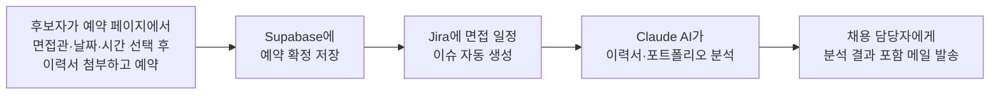

# 뉴런소프트 면접 예약 시스템

후보자가 직접 팀원을 골라 면접 일정을 예약하면, 그 뒤로 필요한 일(Jira 등록, 이력서 분석,
담당자 메일 발송)이 전부 자동으로 처리되는 사이트예요. 코드를 안 봐도 이 문서만 읽으면
"어떻게 동작하는지"는 파악할 수 있게 정리했습니다.

## 🔗 바로가기

| 페이지 | 주소 | 누가 쓰나요 |
|---|---|---|
| 후보자 예약 페이지 | **https://interview.newlearn-soft.com/** | 면접 지원자에게 공유하는 링크 |
| 어드민(슬롯 관리) | **https://interview.newlearn-soft.com/admin.html** | 팀 공유 계정으로 로그인해서 각자 담당자 선택 후 사용 |

> 참고: 위 커스텀 도메인 대신 Vercel 기본 주소(`https://newlearnsoft-interview.vercel.app/`)로도 똑같이 접속돼요.

## 이게 뭐 하는 사이트예요?

한 줄로: **"면접 예약 자동화"**예요. 후보자가 예약 버튼 하나 누르면, 사람이 손댈 필요 없이
아래 4가지가 순서대로 자동 실행돼요.



C·D·E 중 하나가 실패해도(예: 메일 서버 일시 오류) **예약 자체(B)는 이미 끝난 뒤라 후보자에게는
정상적으로 "예약 완료" 화면이 보여요.** 뒷단 실패는 서버 응답 로그에만 남고, 후보자 경험을 막지 않도록
일부러 그렇게 설계했어요.

## 전체 흐름 자세히 보기

### 1️⃣ 후보자가 예약할 때 (`index.html`)

1. 첫 화면에서 팀원 아바타(노아/도치/말티/소호/제이) 중 한 명을 고르면, 그 사람이 비워둔
   시간(슬롯)만 캘린더에 초록 점으로 표시돼요.
2. 날짜 → 시간 순서로 고르고 나면 이름/이메일/연락처/포지션/희망연봉 입력 폼이 나타나고,
   이력서(필수)와 포트폴리오(선택)를 첨부할 수 있어요.
3. 파일을 첨부하면 브라우저가 **Vercel 서버를 거치지 않고 Supabase Storage로 직접** 업로드해요
   (`api/upload-url.js`가 미리 "여기다 올려도 좋다"는 서명된 URL을 발급해주는 방식). 이렇게 하는 이유는
   Vercel 서버리스 함수가 받을 수 있는 요청 크기에 제한이 있어서, 큰 파일이 그 제한에 걸리지 않게 하기 위해서예요.
4. "예약하기" 버튼을 누르면 `api/book-slot.js`가 아래 4단계를 순서대로 처리해요:
   1. **예약 확정** — Supabase `interview_slots` 테이블에서 그 슬롯을 "예약됨"으로 바꿔요. (일반 키가 아니라 서버 전용 키로 처리하는 이유는 아래 "왜 service_role 키를 쓰나요?" 참고)
   2. **Jira 이슈 생성** — `OPER` 프로젝트의 "채용"(OPER-30) 하위에 면접 미팅 이슈를 자동으로 만들어요.
   3. **AI 이력서 분석** — Claude API(`claude-sonnet-5`)가 첨부된 이력서/포트폴리오 PDF를 읽고, 채용 담당자가 면접 전에 1분 안에 훑어볼 수 있는 요약(강점, 확인이 필요한 점, 종합 인상)을 만들어요.
   4. **알림 메일 발송** — Resend를 통해 `newlearnsoft@gmail.com`으로 예약 정보 + Jira 링크 + 위 AI 분석 결과가 담긴 메일을 보내요.

### 2️⃣ 팀원(어드민)이 일정을 관리할 때 (`admin.html`)

- 팀이 공유해서 쓰는 로그인 계정(이메일/비밀번호)으로 들어가요.
- 로그인하면 "오늘은 누구로 접속하시나요?" 화면이 떠요 — 여기서 본인 아바타를 고르면, 그 다음부터는
  본인 이름으로 슬롯을 관리하게 돼요 (브라우저 탭을 새로 열면 다시 물어봐요).
- 캘린더에서 날짜를 클릭하고 시작/종료 시간을 넣으면 새 예약 슬롯이 열려요. 아래 표에서
  전체/담당자별로 필터링해서 볼 수 있고, 슬롯을 지울 수도 있어요.
  - 시간을 거꾸로 넣거나(종료가 시작보다 빠름), 같은 시간에 중복으로 추가하려고 하면 안내 문구가 뜨고 막아줘요.
  - 이미 지원자가 예약한 슬롯을 지우려고 하면 "정말 지울까요?" 경고가 한 번 더 떠요 — 실수로 진짜 예약 데이터를 날리는 걸 막기 위해서예요.
- 이 페이지는 서버(Vercel 함수)를 거치지 않고, 로그인한 브라우저가 Supabase에 직접 요청해요.

### 3️⃣ 대표(노아)님 일정 자동 동기화 (`api/sync-schedule.js`)

노아님은 개인 일정(회의, 발표 등)이 워낙 많아서, **매번 손으로 슬롯을 열고 닫을 필요 없이
Jira에 등록된 본인 일정을 보고 예약 사이트가 알아서 슬롯을 맞춰줘요.** (다른 팀원 슬롯은 이 자동화 대상이
아니고, 각자 어드민 페이지에서 직접 관리해요.)

- **언제 실행되나요?** 두 가지 경로예요 — ① Jira에서 일정(미팅/발표) 이슈가 생성·수정될 때 Jira 쪽에서
  바로 신호를 보내줘서 즉시 반영되고, ② 혹시 놓치는 경우를 대비해 Vercel Cron이 하루 한 번(자정)
  안전망으로 한 번 더 돌아요.
- **어떻게 판단하나요?** Jira 이슈에 적힌 "2026-08-05 (수) 14:00 ~ 15:00" 같은 문구를 읽어서
  "이 시간은 바쁘다"는 목록을 만들고, 평일 업무시간(10-12시, 13-18시) 중 그 시간과 겹치는
  비어있는 슬롯은 자동으로 닫고, 반대로 바쁜 일정이 없어졌으면 슬롯을 다시 열어줘요.
  **이미 지원자가 예약을 확정한 슬롯은 이 자동화가 절대 건드리지 않아요.**

## 폴더 구조

```
index.html          후보자 예약 페이지
admin.html           어드민 슬롯 관리 페이지
style.css            공통 스타일
assets/team/*.png    팀원 아바타 이미지 (노아/도치/말티/소호/제이)
api/
  book-slot.js        예약 확정 + Jira 이슈 생성 + AI 분석 + 메일 발송
  upload-url.js        이력서/포트폴리오 업로드용 서명 URL 발급
  sync-schedule.js      Jira ↔ 슬롯 자동 동기화 (cron + webhook)
vercel.json            cron 설정, book-slot 함수 timeout(60초) 설정
```

## 환경변수

Vercel 프로젝트 → **Settings → Environment Variables**에 아래 값들이 등록돼 있어야 정상 동작해요.
(값 자체는 여기 문서에 절대 적지 않아요 — Vercel 대시보드에서만 확인 가능)

| 변수명 | 어디서 쓰나요 | 무슨 역할이에요? |
|---|---|---|
| `SUPABASE_SERVICE_ROLE_KEY` | book-slot, upload-url, sync-schedule | Supabase에 서버 권한으로 접근하는 키 (아래 "왜 service_role 키를 쓰나요?" 참고) |
| `JIRA_EMAIL` | book-slot, sync-schedule | Jira API 호출용 계정 이메일 |
| `JIRA_API_TOKEN` | book-slot, sync-schedule | Jira API 토큰 |
| `ANTHROPIC_API_KEY` | book-slot | Claude API로 이력서/포트폴리오 분석하는 데 필요 |
| `RESEND_API_KEY` | book-slot | 예약 알림 메일 발송하는 데 필요 |
| `RESEND_FROM_EMAIL` | book-slot | 메일 발신 주소 (예: `채용팀 <no-reply@newlearn-soft.com>`). 비워두면 테스트용 주소로만 발송되니 꼭 채워두세요 |
| `CRON_SECRET` | sync-schedule | Vercel이 하루 한 번 동기화 요청 보낼 때 쓰는 비밀값 |
| `SYNC_WEBHOOK_SECRET` | sync-schedule | Jira에서 동기화 요청 보낼 때 쓰는 비밀값 |

⚠️ **환경변수를 하나라도 새로 넣거나 바꿨다면, 그 뒤에 반드시 재배포(`vercel deploy --prod`)를 해야
실제로 반영돼요.** 그냥 저장만 하고 끝내면 예전 값 그대로 동작하니 꼭 기억해주세요.

## 왜 service_role 키를 쓰나요?

원래는 브라우저가 익명(anon) 키로 직접 Supabase에 "이 슬롯 예약됨으로 바꿔줘"라고 요청하는 게
더 간단한 방법이에요. 그런데 이 프로젝트에서는 그 경로가 Supabase RLS(row-level security) 설정에서
원인을 알 수 없이 계속 막혀서(정책도, 권한도, 트리거도 다 정상인데 이 방식의 요청만 거부됨),
예약 확정(`book-slot.js`)과 자동 동기화(`sync-schedule.js`)는 서버 전용 키(service_role)를 쓰는
Vercel 함수를 통해 우회하고 있어요. 반면 어드민 페이지의 슬롯 추가/삭제는 문제없이 잘 되길래
그대로 브라우저에서 직접 처리해요.

## 로컬 개발 / 배포

```bash
vercel dev             # 내 컴퓨터에서 실행해보기
vercel deploy --prod   # 실제 서비스에 배포 (환경변수 바꾼 뒤에도 반드시 다시 실행!)
```

## 알려둘 점 / 나중에 개선하면 좋은 것

- `book-slot.js`에서 Jira 이슈 생성·AI 분석·메일 발송 중 하나가 실패해도 예약 자체는 실패 처리 안 해요.
  응답 JSON의 `jiraError` / `analysisError` / `emailError` 값을 보면 어느 단계가 왜 실패했는지 알 수 있어요.
- 이력서/포트폴리오는 **PDF일 때만** Claude가 분석해줘요 (doc/docx/hwp는 업로드는 되지만 AI 분석은 생략됨).
- Supabase Storage 버킷(`resumes`)은 공개 읽기(public read)로 설정돼 있어야 Claude가 파일을 읽을 수 있어요.
